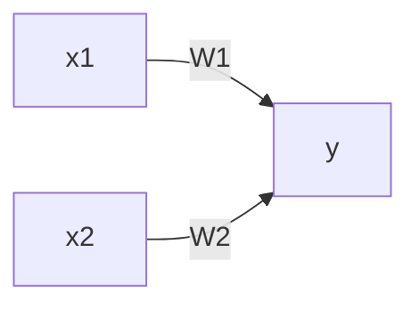

# ゼロから作ろ Deep Learning Pythinで学ぶDピラーニングの理論と実装

## 2章 パーセプトロン

### パーセプトロンとは
パーセプトロンとは複数の信号を入力として受け取り、ひとつの信号を出力する。ここでいう「信号」は電流や川のような「流れ」のイメージが適当。

パーセプトロンは信号を「流す」or「流さない」の2つの選択肢しか取らない。

イメージ(xが入力信号で、yが出力信号。wは重み)。図のxなどを囲っている四角は「ニューロン」と呼ばれる。

数式で表すと以下になる。

$$
\left\{
  \begin{array}{c}
    \text{0 ( $\omega_1\chi_1 + \omega_2\chi_2 \leqq \theta $ )} \\\
    \text{0 ( $\omega_1\chi_1 + \omega_2\chi_2 > \theta $ )}
  \end{array}
\right.
$$

### パーセプトロンで単純な回路を表現すｆる
