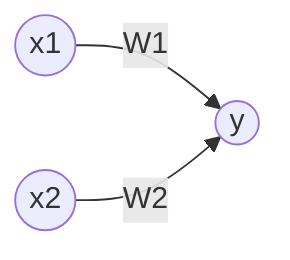
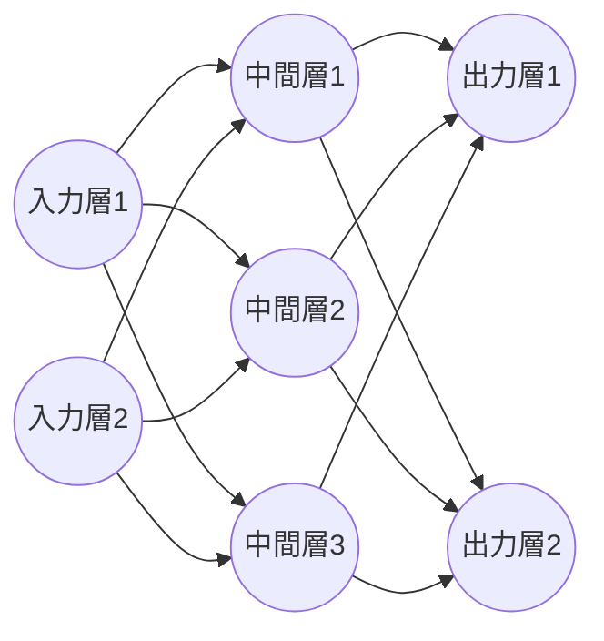

# ゼロから作ろ Deep Learning Pythinで学ぶDピラーニングの理論と実装

## 2章 パーセプトロン

### パーセプトロンとは
パーセプトロンとは複数の信号を入力として受け取り、ひとつの信号を出力する。ここでいう「信号」は電流や川のような「流れ」のイメージが適当。

パーセプトロンは信号を「流す」or「流さない」の2つの選択肢しか取らない。

イメージ(xが入力信号で、yが出力信号。wは重み)。図のxなどを囲っている四角は「ニューロン」と呼ばれる。

数式で表すと以下になる。 
送られてきた信号の総和が計算され、閾値を超えたら出力し(信号を流す)、超えないときは出力しない(信号を流さない)という感じ。

$$
y =
\left\{
  \begin{array}{c}
    \text{ 0 ( $\omega_1\chi_1 + \omega_2\chi_2 \leqq \theta $ )}\\\
    \text{1 ( $\omega_1\chi_1 + \omega_2\chi_2 > \theta $ )}
  \end{array}
\right.
$$

### パーセプトロンで単純な回路を表現する
論理回路の**AND**をパーセプトロンで表現できる。 
以下の真理値表を満たすように、$\omega_1, \omega_2, \theta $の値を決める。例えば、$(\omega_1, \omega_2, \theta) = (0.5, 0.5, 0.7)$ として上の式に当てはめて計算すると真理値表と同じように動作する。(**パラメータの選び方は無数にある**)

| $$\chi_1$$ | $$\chi_2$$ | $$y_2$$ |
| ------------- | ------------- | --- |
|0  | 0 | 0 |
| 0  | 1 | 0 |
| 1  | 0 | 0 |
| 1  | 1 | 1 |

ANDだけでなく、NANDもORもパーセプトロンで表現可能。

ただ、**1つのパーセプトロンには限界があり、XOR回路は表現できない**。 
**パーセプトロンを複数使う(層を重ねる)ことでXORも表現可能となる。**
(※理論上、パーセプトロンの層を重ねればコンピュータを作ることができる)

## 3章 ニューラルネットワーク

$\sqrt{3x-1}+(1+x)^2$aaaa

aaa$\sqrt{3x-1}+(1+x)^2$

aaa $\sqrt{3x-1}+(1+x)^2$ adddd

\dfrac
